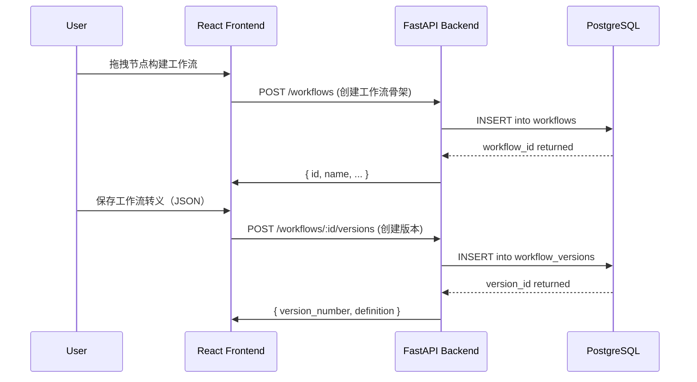
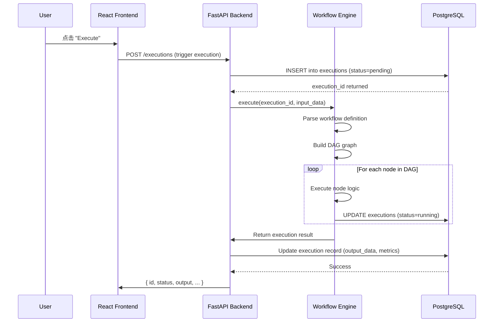

# 🏗️ AgentFlow Studio - 系统架构设计文档

## 📋 概述

AgentFlow Studio 是一个企业级 AI Agent 开发平台，采用前后端分离的现代化技术栈，支持可视化工作流编排、Git 版本管理、CI/CD 集成和 SDK 自动生成。

---

## 🎯 系统架构图

```
┌─────────────────────────────────────────────────────────────┐
│                        Client Layer                          │
│  ┌──────────────┐  ┌──────────────┐  ┌──────────────┐      │
│  │   Web Browser│  │ Mobile App?  │  │ Desktop App? │      │
│  └──────┬───────┘  └──────┬───────┘  └──────┬───────┘      │
│         │                  │                  │               │
│         ▼                  ▼                  ▼               │
│  ┌──────────────────────────────────────────────────┐       │
│  │          React Frontend (TypeScript)             │       │
│  │  • Visual Workflow Editor                        │       │
│  │  • Node Library & Templates                      │       │
│  │  • Settings & Admin Panel                        │       │
│  └─────────────────┬───────────────────────────────┘       │
└────────────────────┼────────────────────────────────────────┘
                     │ HTTPS / REST API
┌────────────────────┴────────────────────────────────────────┐
│                      API Gateway Layer                       │
│  ┌─────────────────────────────────────────────────┐        │
│  │   FastAPI (Python) + Node.js (Fastify)         │        │
│  │  • Authentication & Authorization              │        │
│  │  • Rate Limiting & Security                    │        │
│  │  • Request Validation                          │        │
│  └──────────────┬───────────────┬─────────────────┘         │
└─────────────────┼───────────────┼───────────────────────────┘
                  │               │
┌─────────────────┴──────┐   ┌───┴──────────────────────────┐
│      Backend Services  │   │    External Integrations     │
│                        │   │                              │
│ • Workflow Service     │   │ • LLM Providers              │
│ • Execution Engine     │   │   - OpenAI                   │
│ • Plugin Manager       │   │   - Anthropic                │
│ • User Auth            │   │   - Google Vertex AI         │
└───────────────┬────────┘   └──────────────┬───────────────┘
                │                           │
┌─────────────────────────────────────────────────────────────┐
│                       Data Layer                             │
│  ┌──────────────┐  ┌──────────────┐  ┌──────────────┐      │
│  │PostgreSQL    │  │   Redis      │  │   File System│      │
│  │(Primary DB)  │  │ (Cache/Queue)│  │ (Plugins, etc)│      │
│  └──────────────┘  └──────────────┘  └──────────────┘      │
└─────────────────────────────────────────────────────────────┘
```

---

## 📦 技术栈详解

### 前端技术栈

| 类别 | 技术选型 | 版本要求 | 作用 |
|------|---------|---------|------|
| **框架** | React | 18.3+ | UI 组件库，声明式编程 |
| **语言** | TypeScript | 5.4+ | 类型安全，减少运行时错误 |
| **构建工具** | Vite | 5.4+ | 极速开发服务器和构建 |
| **状态管理** | Zustand | 4.5+ | 轻量级全局状态管理 |
| **HTTP 客户端** | Axios | 1.7+ | API 请求封装 |
| **UI 组件库** | Ant Design / shadcn/ui | - | 企业级 UI 组件 |
| **工作流可视化** | React Flow | - | 流程图画布核心 |

#### 前端项目结构
```
frontend/
├── src/
│   ├── components/          # 可复用组件
│   │   ├── layout/         # Header, Sidebar
│   │   └── canvas/         # WorkflowCanvas, Node, ConnectionLine
│   ├── hooks/              # 自定义 Hooks
│   ├── stores/             # Zustand 状态存储
│   ├── types/              # TypeScript 类型定义
│   ├── services/           # API 服务层封装
│   └── utils/              # 工具函数库
├── package.json            # NPM 依赖配置
├── vite.config.ts          # Vite 构建配置
└── tsconfig.json           # TypeScript 编译配置
```

### 后端技术栈

| 类别 | 技术选型 | 版本要求 | 作用 |
|------|---------|---------|------|
| **框架** | FastAPI | 0.110+ | Web 框架，自动文档生成 |
| **语言** | Python | 3.10+ | AI/ML生态最成熟的语言 |
| **数据库 ORM** | SQLAlchemy | 2.0+ | 对象关系映射 |
| **数据库驱动** | psycopg2-binary | 2.9+ | PostgreSQL 客户端 |
| **缓存/队列** | Redis | 7.0+ | 缓存和消息队列 |
| **依赖注入** | FastAPI Depends | - | 优雅的依赖管理 |

#### 后端项目结构
```
backend/
├── main.py                 # 应用入口点
├── models/                 # ORM 模型定义
│   ├── base.py            # 基础模型类
│   ├── workflow.py        # Workflow & Version 模型
│   └── execution.py       # Execution 记录模型
├── services/               # 业务逻辑层
│   ├── workflow_service.py
│   ├── workflow_engine.py
│   └── plugin_service.py
├── routes/                 # RESTful API 路由
│   ├── workflows.py
│   └── executions.py
├── db/                     # 数据库配置
│   ├── database.py        # SQLAlchemy engine & session
│   └── init.sql           # PostgreSQL DDL 脚本
└── requirements.txt        # Python 依赖列表
```

---

## 🗄️ 数据库架构设计

### 核心表结构

#### 1. Users (用户表)
```sql
CREATE TABLE users (
    id VARCHAR(36) PRIMARY KEY,           -- UUID
    email VARCHAR(255) UNIQUE NOT NULL,   -- 登录邮箱
    password_hash VARCHAR(255) NOT NULL,  -- 密码哈希（bcrypt）
    role VARCHAR(50) DEFAULT 'user',      -- user / admin
    is_active BOOLEAN DEFAULT TRUE,       -- 账户状态
    created_at TIMESTAMP WITH TIME ZONE,
    updated_at TIMESTAMP WITH TIME ZONE
);
```

#### 2. Workflows (工作流定义表)
```sql
CREATE TABLE workflows (
    id VARCHAR(36) PRIMARY KEY,
    owner_id VARCHAR(36) REFERENCES users(id),
    name VARCHAR(255) NOT NULL,
    description TEXT,
    is_public BOOLEAN DEFAULT FALSE,      -- 是否公开可见
    status VARCHAR(50) DEFAULT 'draft',   -- draft / active / archived
    created_at TIMESTAMP WITH TIME ZONE,
    updated_at TIMESTAMP WITH TIME ZONE
);
```

#### 3. Workflow Versions (版本控制表 - Git 式)
```sql
CREATE TABLE workflow_versions (
    id VARCHAR(36) PRIMARY KEY,
    workflow_id VARCHAR(36) REFERENCES workflows(id),
    version_number INTEGER NOT NULL,      -- 版本号（1, 2, 3...）
    name VARCHAR(255) NOT NULL,
    description TEXT,
    definition JSONB NOT NULL,            -- 完整工作流转义（JSONB for performance）
    author_id VARCHAR(36),                -- 作者 ID
    created_at TIMESTAMP WITH TIME ZONE,
    
    UNIQUE(workflow_id, version_number)   -- 同一工作流唯一版本号
);
```

#### 4. Executions (执行记录表)
```sql
CREATE TABLE executions (
    id VARCHAR(36) PRIMARY KEY,
    workflow_id VARCHAR(36) REFERENCES workflows(id),
    version_id VARCHAR(36) REFERENCES workflow_versions(id),
    trigger_type VARCHAR(50),             -- 'api' | 'schedule' | 'webhook'
    input_data JSONB,                     -- 输入参数
    output_data JSONB,                    -- 输出结果
    status VARCHAR(50) DEFAULT 'pending', -- pending / running / success / failed
    error_message TEXT,
    started_at TIMESTAMP WITH TIME ZONE,
    finished_at TIMESTAMP WITH TIME ZONE,
    
    INDEX idx_workflow (workflow_id),
    INDEX idx_status (status)
);
```

#### 5. Plugins (插件表)
```sql
CREATE TABLE plugins (
    id VARCHAR(36) PRIMARY KEY,
    name VARCHAR(255) UNIQUE NOT NULL,
    version VARCHAR(50) NOT NULL,
    author VARCHAR(255),
    description TEXT,
    manifest JSONB NOT NULL,              -- 插件元数据（JSONB）
    installed_by VARCHAR(36) REFERENCES users(id),
    is_active BOOLEAN DEFAULT TRUE,
    created_at TIMESTAMP WITH TIME ZONE
);
```

---

## 🔌 API 接口设计

### RESTful API 规范

所有 API 遵循 REST 原则，统一响应格式：

#### 成功响应
```json
{
  "success": true,
  "data": { ... },
  "message": "操作成功"
}
```

#### 错误响应
```json
{
  "error": "Error description",
  "detail": "Detailed error message",
  "path": "/api/v1/workflows/xxx"
}
```

---

### 核心 API 端点

#### Workflows（工作流）

| HTTP 方法 | Endpoint | 描述 |
|----------|---------|------|
| `GET` | `/api/v1/workflows` | 列出所有工作流（支持分页、筛选） |
| `POST` | `/api/v1/workflows` | 创建工作流 |
| `GET` | `/api/v1/workflows/:id` | 获取工作流详情 |
| `PUT` | `/api/v1/workflows/:id` | 更新工作流属性 |
| `DELETE` | `/api/v1/workflows/:id` | 删除工作流 |

#### Workflow Versions（版本管理）

| HTTP 方法 | Endpoint | 描述 |
|----------|---------|------|
| `POST` | `/api/v1/workflows/:id/versions` | 创建新版本 |
| `GET` | `/api/v1/workflows/:id/versions` | 列出所有版本 |
| `GET` | `/api/v1/workflows/:id/versions/:from/:to/diff` | 对比两个版本差异 |

#### Executions（执行记录）

| HTTP 方法 | Endpoint | 描述 |
|----------|---------|------|
| `POST` | `/api/v1/executions` | 手动触发工作流执行 |
| `GET` | `/api/v1/executions` | 列出执行历史 |
| `GET` | `/api/v1/executions/:id` | 获取执行详情 |
| `GET` | `/api/v1/executions/:id/logs` | 获取执行日志 |
| `POST` | `/api/v1/executions/:id/cancel` | 取消运行中的执行 |

---

## 🔄 数据流设计

### 工作流创建流程



### 工作流执行流程



---

## 🔐 安全设计

### 认证与授权

1. **JWT Token 机制**
   - Access Token: 有效期 30 分钟（HS256）
   - Refresh Token: 用于获取新 Access Token
   - 存储在 localStorage（前端）和 HttpOnly Cookie（后端，可选）

2. **角色权限管理**
   ```python
   # 角色定义
   USER_ROLE = "user"        # 普通用户：创建、编辑自己的工作流
   ADMIN_ROLE = "admin"      # 管理员：所有操作 + 系统配置
   ```

3. **API 保护中间件**
   ```python
   @router.post("/workflows", dependencies=[Depends(require_admin)])
   async def create_workflow(...):
       pass
   
   @router.get("/workflows/{id}", dependencies=[Depends(require_owner)])
   async def get_workflow(...):
       pass
   ```

---

## 📈 性能优化策略

### 1. 数据库层
- ✅ **连接池**：PostgreSQL max_connections=20, pool_size=10
- ✅ **索引优化**：常用查询字段建立联合索引
- ✅ **JSONB 支持**：workflows.definition 使用 JSONB 格式（快速查询）

### 2. 缓存层
- ✅ **Redis 缓存热点数据**：工作流定义、用户配置
- ✅ **TTL 策略**：执行结果缓存 5 分钟，工作流元数据缓存 1 小时

### 3. 前端优化
- ✅ **代码分割**：React.lazy + Suspense
- ✅ **CDN 资源加载**：静态资源使用 CDN
- ✅ **懒加载**：节点库、插件市场按需加载

### 4. 异步处理
- ✅ **任务队列**：长时间执行的任务放入 Redis Queue（Celery/RQ）
- ✅ **Webhook 支持**：支持定时触发和外部事件触发

---

## 🚀 扩展性设计

### 水平扩展能力

```
┌─────────────────────────────────────────┐
│        Load Balancer (Nginx)            │
│         ┌──────┬──────┬──────┐          │
│         │ Worker 1 │ Worker 2 │ ... │    │
│         │(FastAPI) │(FastAPI) │     │    │
└─────────────────────────────────────────┘
            │           │
       ┌────┴───────────┴────┐
       │   PostgreSQL (主从复制) │
       │  Redis Cluster        │
       └──────────────────────┘
```

### 插件扩展机制

开发者可以创建自定义节点/工具：

```typescript
// 示例：自定义天气查询节点接口
interface WeatherNode extends Node {
  type: 'weather';
  config: {
    apiKey?: string;
    location: string;
    forecastDays?: number;
  };
}
```

插件通过声明式 JSON Schema 注册到系统，自动获得：
- ✅ 节点 UI 渲染支持
- ✅ 执行逻辑封装
- ✅ 错误处理统一机制

---

## 📊 监控与日志

### 关键指标（Prometheus）
- `execution_duration_seconds` - 执行耗时
- `node_execution_total` - 节点执行次数
- `token_usage_total` - Token 消耗总量
- `error_rate` - 错误率

### 日志分级
- **DEBUG**: 开发调试用，详细参数流转
- **INFO**: 正常业务操作记录
- **WARNING**: 潜在问题提示（如重试）
- **ERROR**: 异常和失败信息

---

## 🎯 未来演进方向

1. **AI 辅助工作流设计** - 自然语言描述自动生成工作流
2. **机器学习优化执行路径** - 预测最优节点顺序减少延迟
3. **团队协作功能增强** - 多人实时编辑、代码审查流程
4. **更多第三方集成** - Slack, Discord, Microsoft Teams 等通知渠道

---

<div align="center">

**Document Version:** 1.0  
**Last Updated:** January 2024  
**Maintained by:** AgentFlow Studio Team  

</div>
